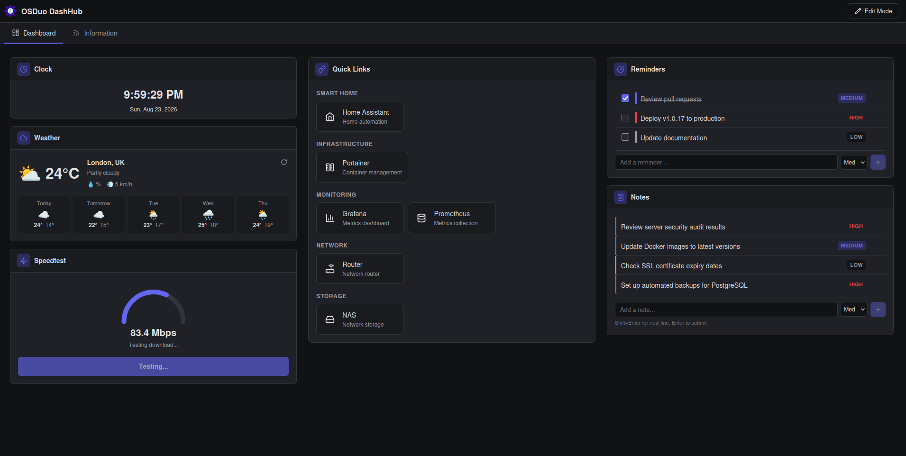
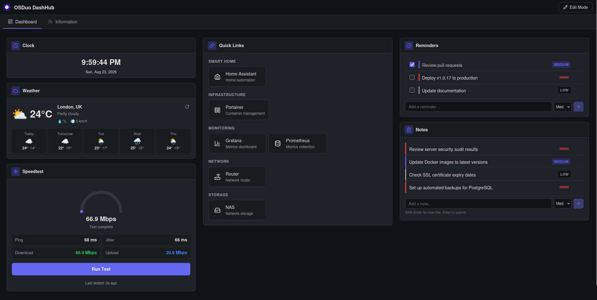
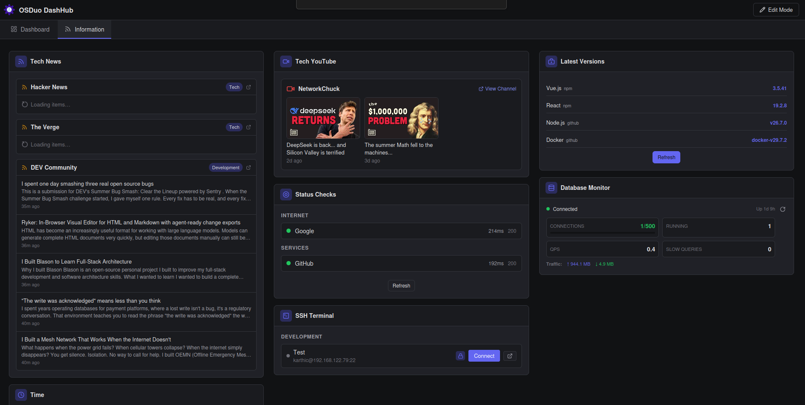

# OSDuo DashHub

**A local-first, self-hosted operations dashboard for infrastructure, servers, productivity, and everyday tools.**

DashHub brings server monitoring, SSH access, system administration, productivity tools, service health, useful links, and information feeds into a single customizable workspace.

Designed for **local and trusted private-LAN deployments**, DashHub runs on your own infrastructure using Docker.

### Dashboard





### Information Page



## Why DashHub?

DashHub is designed for people who manage multiple servers, services, applications, and operational resources and want a single workspace instead of maintaining dozens of browser tabs.

Instead of replacing your existing tools, DashHub brings them together:

- Monitor your servers
- Open SSH sessions
- Check service health
- Access frequently used applications
- Track infrastructure information
- Keep notes, reminders, and calendar events
- Follow RSS feeds and YouTube channels
- Customize the workspace around your workflow

## Features

### Dashboard

- **Custom Dashboard Pages** — Create, rename, reorder, and delete pages
- **Configurable Page Layouts** — Choose the number of columns for each page
- **Custom Widget Placement** — Decide which widgets appear on each page and arrange them across columns
- **Drag & Drop Layout** — Move widgets within and between columns or pages
- **Customizable Layouts** — Arrange widgets across multiple columns
- **Edit Mode** — Configure dashboards directly from the UI
- **Themes & Branding** — Theme-aware interface with reusable icons and branding

### Infrastructure & Server Management

- **SSH Terminal** — Web-based terminal with xterm.js and saved SSH connections
- **Process List** — Monitor server processes through SSH with sortable tables
- **System Info** — CPU, RAM, disk, and network information through SSH
- **Service Status** — Monitor systemd services through SSH
- **System Logs** — View journalctl logs through SSH
- **Database Monitor** — Monitor MySQL/MariaDB databases through SSH
- **Server Monitoring** — Real-time CPU, memory, disk, and network metrics using Glances
- **Server Uptime** — Monitor endpoint availability with history
- **Status Indicators** — Endpoint health and latency indicators

### Productivity

- **Calendar** — Month view and upcoming events from Nextcloud/CalDAV with event creation/deletion
- **Notes** — Personal notes with priority and inline editing (click any note to edit)
- **Reminders** — Task reminders with completion tracking and inline editing
- **Clock** — Live time and date display

### Network & Utilities

- **Public IP** — Public IP and location information
- **Speedtest** — Network latency, download, and upload testing
- **Weather** — Current conditions and forecast
- **Latest Versions** — Track package versions from npm, GitHub, and PyPI

### Information & Resources

- **Quick Links** — Customizable bookmarks with categories and icons
- **RSS Feeds** — News and article aggregation
- **YouTube** — Latest videos from selected channels
- **IFrame** — Embed compatible web applications and web content

## Documentation

- **In-app help** — click **Help** in the toolbar or visit `/help` while DashHub is running
- [User Manual](docs/user-manual/README.md) — building and using your dashboard
- [Installation & Deployment](docs/deployment/README.md) — Docker, Compose, upgrades, data
- [Security](docs/project/SECURITY.md) — Phase 1 boundary and Phase 2 plan
- [Phase 2 Work Plan](docs/project/PHASE2.md) — prioritized security & feature roadmap
- [Status](docs/project/STATUS.md) — implemented / planned feature matrix
- [Changelog](docs/project/CHANGELOG.md) — release history

## Self-Hosted

DashHub is designed to run on your own infrastructure.

- Local-first architecture
- No hosted DashHub account required
- Persistent local configuration
- Docker and Docker Compose
- linux/amd64 + linux/arm64 images
- GitHub Container Registry
- Suitable for personal and trusted private-LAN environments

> **Deployment boundary:** DashHub v1.x is designed for local and trusted private-LAN use. Public Internet and shared multi-user deployment require additional security hardening planned for Phase 2.

## Quick Start

### Docker Compose — Recommended

```bash
mkdir dashhub && cd dashhub
mkdir data
curl -O https://raw.githubusercontent.com/devosduotech/dashhub/v1.0.19/docker-compose.yml
docker compose up -d
```

Open http://localhost:48215

### Docker Image

```bash
docker run -d \
  --name dashhub \
  -p 48215:80 \
  -v "$PWD/data":/app/data \
  --restart unless-stopped \
  ghcr.io/devosduotech/dashhub:1.0.19
```

### Build from Source

```bash
git clone https://github.com/devosduotech/dashhub.git
cd dashhub
cp .env.example .env
docker compose -f docker-compose.yml -f docker-compose.dev.yml up -d --build
```

Open http://localhost:48216

## Upgrading

For a pinned release:

```bash
docker compose pull
docker compose up -d
```

Your configuration and persistent data remain in the `data/` directory.

## Configuration

DashHub is configured through the web interface:

1. Enable Edit Mode
2. Add widgets from the widget palette
3. Configure each widget
4. Arrange widgets using drag & drop
5. Configuration is automatically persisted to `data/conf.yml`

## Widget Categories

| Category | Widgets |
|----------|---------|
| Infrastructure | SSH, Glances, System Info, Process List, Service Status, System Logs, Database Monitor, Latest Versions |
| Monitoring | Uptime, Status Indicators, Glances |
| Productivity | Calendar, Notes, Reminders, Clock |
| Network | Public IP, Speedtest, Weather, Latest Versions |
| Information | RSS, YouTube, Quick Links, IFrame |

## Technology

| Component | Technology |
|-----------|------------|
| Frontend | Vue.js 3 |
| Build | Vite |
| State | Pinia |
| Terminal | xterm.js |
| SSH | Node.js + ssh2 + WebSocket |
| Calendar | CalDAV + ical.js |
| API | Express |
| Web Server | nginx |
| Container | Docker + Docker Compose |

## Docker Images

Images are published through GitHub Container Registry:

| Tag | Description |
|-----|-------------|
| `1.0.19` | Current release |
| `latest` | Latest stable release |

Pull the current release:

```bash
docker pull ghcr.io/devosduotech/dashhub:1.0.19
```

View [Docker Images on GitHub](https://github.com/devosduotech/dashhub/pkgs/container/dashhub)

## Project Structure

```
dashhub/
├── src/                    # Vue.js frontend
│   ├── components/
│   │   └── widgets/        # Widget components
│   ├── services/           # API client services
│   ├── stores/             # Pinia stores
│   └── types/              # TypeScript types
├── server/
│   └── api/                # Express API server
│       ├── server.js       # Main server
│       ├── sshBridge.js    # WebSocket SSH bridge
│       ├── caldavClient.js # CalDAV proxy
│       └── processClient.js# Process list via SSH
├── config/
│   └── default.yml         # Default configuration
├── scripts/
│   └── install-glances.sh  # Glances agent installer
└── docker-compose.yml      # Production Compose configuration
```

## License

MIT License

## References

- [Glances](https://github.com/nicolargo/glances) — Server monitoring
- [Glance](https://github.com/glanceapp/glance) — Feed aggregation reference
- [Tabby](https://github.com/eugeny/tabby) — SSH management reference
