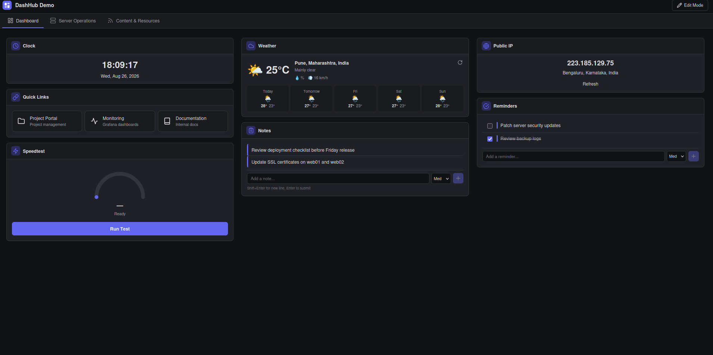

# Getting Started

This chapter covers accessing DashHub, understanding the interface, moving between pages, and using Edit Mode. Installation is covered in the [Deployment Guide](../deployment/README.md).

> **Figure 1 — DashHub workspace**

## Accessing DashHub

Open the address where DashHub is running in a browser:

- Default Docker Compose install: `http://localhost:48215`
- Custom port: `http://<host>:<port>` as configured during deployment

No login is required. DashHub v1.x is designed for a single user on a local machine or a trusted private LAN — see the [security boundary notes](../deployment/README.md#deployment-boundary).

## Understanding the interface

The screen has four areas:

| Area | Location | Purpose |
|------|----------|---------|
| **Toolbar** | Top | Dashboard title, logo, Edit Mode toggle |
| **Page tabs** | Below toolbar | One tab per page; click to switch, drag to reorder (Edit Mode) |
| **Widget grid** | Center | The current page's columns and widgets |
| **Footer** | Bottom | Configurable footer text |

## Navigation

- Click any **page tab** to open that page.
- The last active page is remembered and restored on your next visit.
- Widgets that poll data (uptime, monitoring, logs) refresh on their own schedule while their page is open. Background pages do not poll — switch to a page to see fresh data.

## Edit Mode

Edit Mode is where all configuration happens. Toggle it with the **Edit Mode** button in the top-right toolbar.

When Edit Mode is **on**:

- The **widget palette** appears for adding widgets
- Each widget header shows its controls: **Settings** (gear), **Move to page** (arrow, when other pages exist), **Remove** (trash)
- Page tabs gain **settings**, **delete**, and **drag-to-reorder** affordances
- The toolbar shows an "Editing Dashboard" badge so you always know the mode

When Edit Mode is **off**, the dashboard is a clean, interactive workspace — widgets run, terminals connect, notes are editable — but nothing can be added, moved, or removed.

> **Note:** Widget configuration changes are applied and saved automatically as you make them (approximately one second after your last change). Closing a settings dialog with **Cancel** closes the dialog only — it does not undo changes already made. Treat the settings dialog as live.

---

Next: [Building Your Dashboard](dashboard.md)
